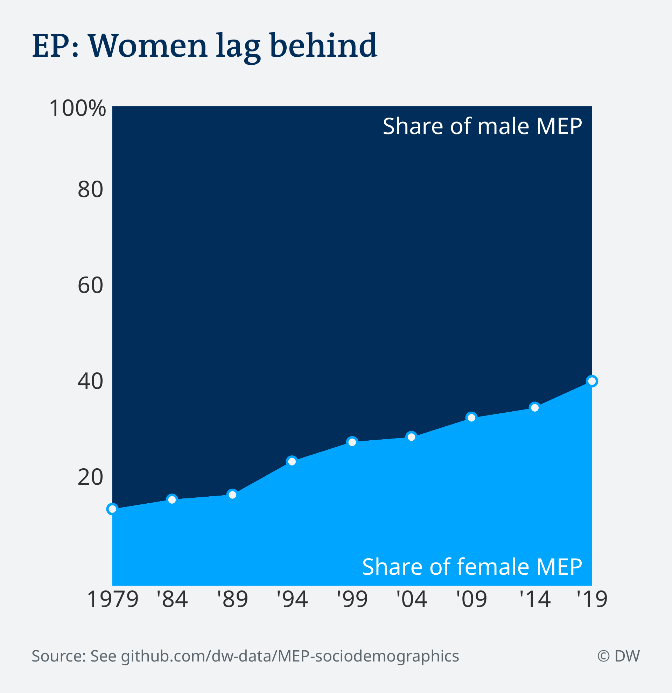
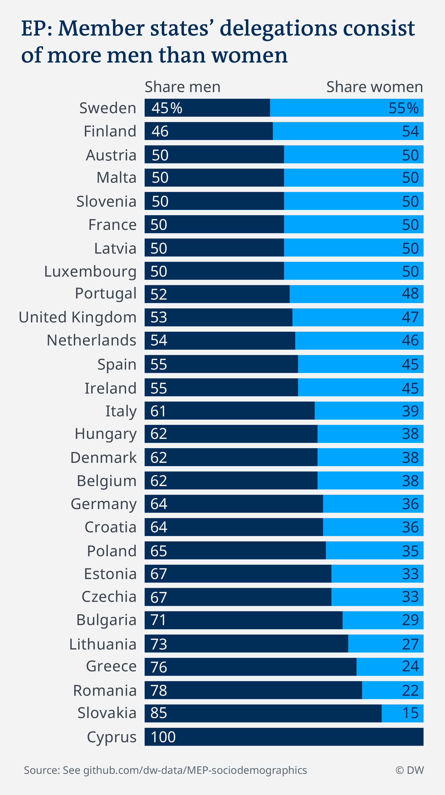
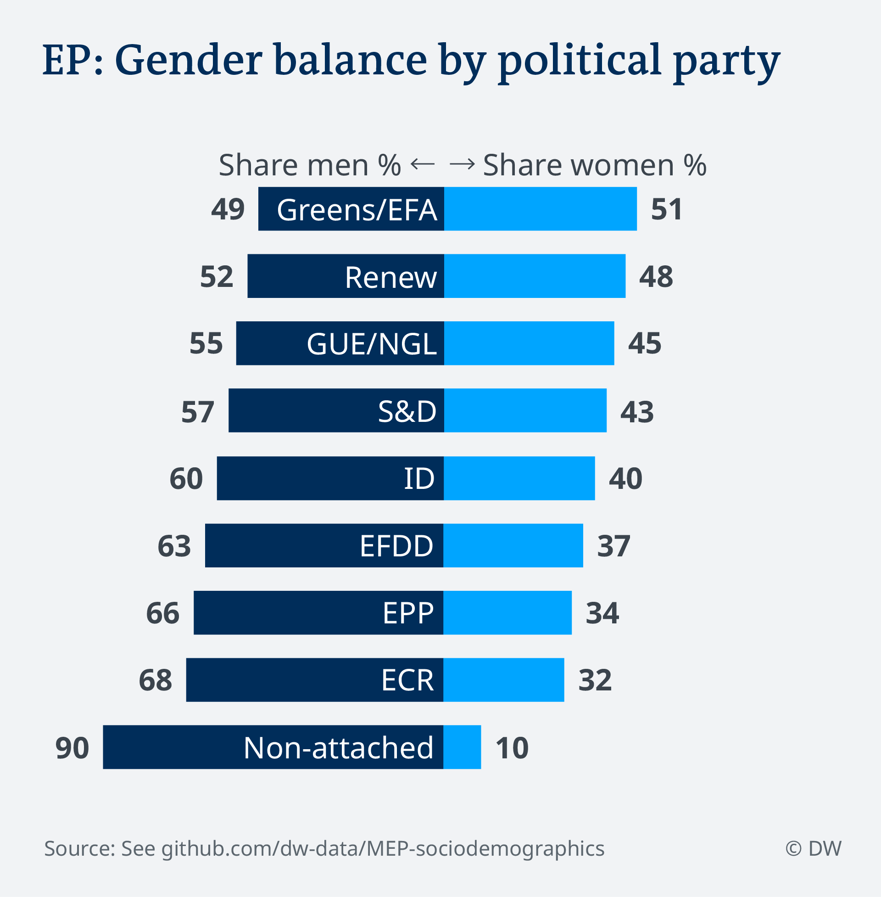
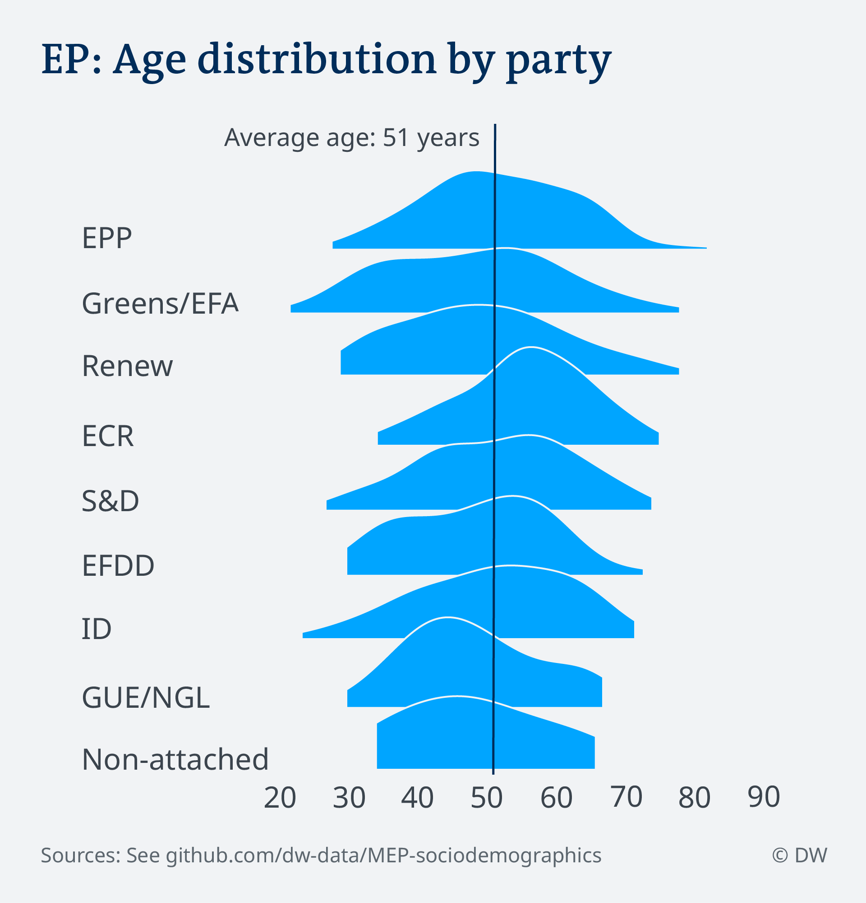

# What is the gender balance of the new 2019 European parliament?

You can read the story based on this analysis [here.](https://p.dw.com/p/3LPEN)

**Research and writing:** [Sabine Kinkartz](https://twitter.com/sgcki)

**Idea:** Ingo Manteufel, DW's Head of Department for Russia, Ukraine and Belarus 

**Data research, analysis, visualization:** [Tom Wills](https://twitter.com/tomwills), [Gianna-Carina Gruen](https://twitter.com/giannagruen)

**Additional data research and verification:** [Juuso Järviniemi](https://twitter.com/juusojarviniemi)

## Data sources

This analysis is based on multiple sources as at the time of the analysis end of June, official final results for all EU member states were not available.

We started with a dataset provided by Britain-based independent information service [Dods People (DP)](http://www.dodspeople.eu/Page.aspx?pageid=47), that included names, titles, country, national party, date of birth and EP group affiliation for elected MEPs.

We checked this spreadsheet against information provided by the European parliament who obtained ["official candidate lists"](data/EP-documents) (see disclaimer below) from authorities in member states. At the time of analysis, 22 member states had provided such lists. Such lists were not available from Germany, Belgium, Italy, Portugal, Denmark and the Netherlands and in those cases we relied entirely on the data provided by DP.

In case of a mismatch between EP and DP information, we went with the information provided by the European Parliament. This was the case for 
- Austria: Roman Haider instead of Petra Steger
- Bulgaria: Emil Yordanov Radev instead of Lilyana Pavlova
- Greece: Lefteris Nikolaou-Alavanos instead of Asimina Digeni
- Hungary: István Ujhelyi instead of Bertalan Tóth
- Spain: Maria Esperanza Araceli Aguilar Pinar instead of Mazaly Aguilar Povill (the same person with different names? [See EU page](https://multimedia.europarl.europa.eu/sv/mazaly-aguilar-official-portrait-9th-parliamentary-term_20190618_ARACELI_AGUILAR_PINAR_Maria_Esperanza_ES_031_p#ssh))

In the case of Spain, the European parliament told DW that the reporting authorities notified them that three of the 54 Spanish seats in the EP will remain empty until further notice, as Oriol Junqueras, Carles Puigdemont and Antoni Comín "do not fulfill the prerequesites to take up their mandate in the EP. Thus, they were not included in this analysis, putting the total number of MEPs at 748.

### EP group affiliations

The resulting dataset included entries for 16 MEPs with no stated EP group affiliation (NaN); DW's Brussels studio researched these cases and added in affiliations based on media reports, parties websites and official announcements. You can check these cases and source for their added affiliation [here](data/MEP-missing-EPgroup-affiliations.xlsx). After this additional research, only one male MEP (Ivan Vilibor Sinic, part of the Croatian delegation and member of the Human Shield party) remains uncategorized.

### Age of MEP

The obtained dataset did not include the date of birth nor year of birth for 82 MEP. From additional sources, we could fill in the date of birth or birth year for 64 MEP, leaving us with no age-related information for 18 out of 748 MEP (equals 2 percent of MEP). Accordingly, our age analysis comes with this inherit inaccuracy.

*Disclaimer: Although information provided by the European Parliament is labeled as "official list" they are still open to change and thus not to regard as final until the actual opening session on July 2nd, 2019. Even after that date, MEPs can change.*

## Results

You can read the story based on this analysis [here.](https://p.dw.com/p/3LPEN)

### Gender balance of the European parliament over time

### Gender balance of the new European parliament 2019, by country

### Gender balance of the new European parliament 2019, by EP group

### Age distribution of the new European parliament 2019, by EP group

